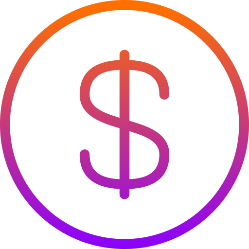
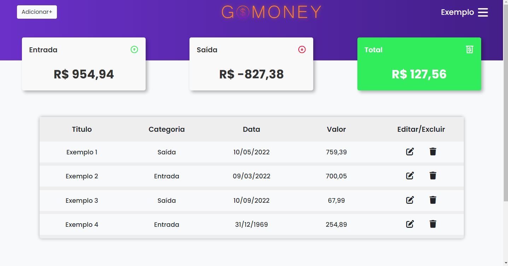
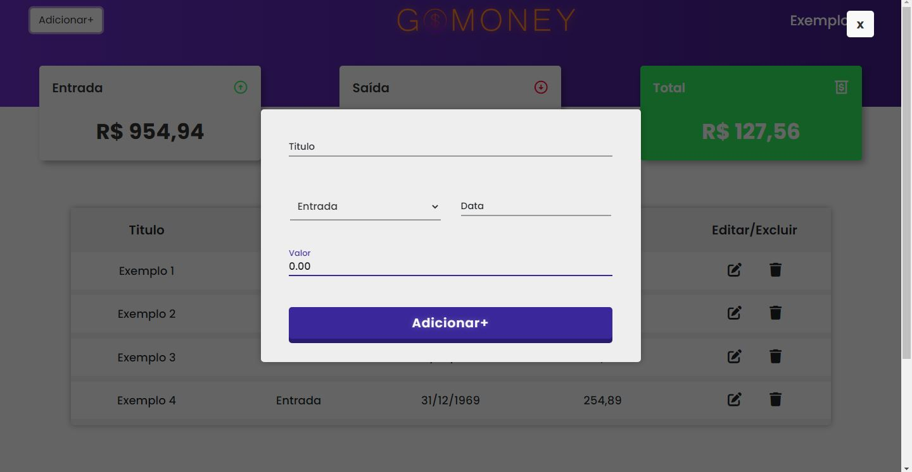

  

---

<h1 align="center"> Trayt</h1>

<h3 align="center">✔ STATUS: Concluído ✔</h3>

---

<h2 align="center">📖Sobre</h2>

Esse projeto é um tipo de sistema de controle financeiro e foi feito para estudos de PHP com MySQL usando o CRUD, ele consiste em uma página principal que verifica primeiramente se você esta logado ou não, se não estiver ela manda você para a página de login, e se você não tem uma conta, basta criar na pagina de cadastro, ou se você esqueceu a senha, basta criar uma nova na página de troca de senha, estando logado e na pagina principal você consegue adicionar um item com informações como o título, tipo (se é entrada ou saída), data e valo. Consegue também editar ou remover o item em específico, se precisar trocar alguma informação pessoal basta ir à página de configurações e fazer tais modificações, e se quiser sair basta abrir o menu e clicar em “Sair”, que ele irá fazer o sistema de logout.

---

<h2 align="center">✔O site contém:</h2>

✅ Consexão com banco de dados MySQL 
✅ CRUD 
✅ Login/Cadastro 
✅ Navbar 
✅ Modal 
### etc...
---

O projeto vai ser iniciado em <a target="_blank" href='http://localhost/gomoney/'>http://localhost/gomoney

<h2 align="center">🖥Preview</h2>

</img>
 
 
</img>

---

<h2 align="center">🛠 Tecnologias</h2>

- [PHP](https://www.php.net/)
- [HTML](https://html.com/)
- [CSS](https://developer.mozilla.org/pt-BR/docs/Web/CSS)
- [MySQL](https://www.mysql.com/)

---

<h2 align="center">📝Licença</h2>

   Este repositório está sob licença MIT. Você pode ver o arquivo <a href="https://github.com/gabriell-c/gomoney/blob/main/LICENSE"> LICENSE</a>
   para mais detalhes. 😉

